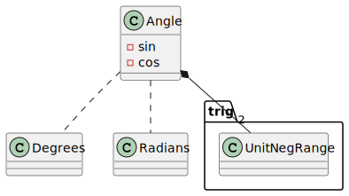

# angle-sc

A library which implements trigonometric functions with an angle represented by
its sine and cosine.

The sine and cosine of an angle can be visualised as the coordinates of a
unit circle, see *Figure 1*.

  
*Figure 1 Unit Circle*

[Angle sum and difference identities](https://en.wikipedia.org/wiki/List_of_trigonometric_identities#Angle_sum_and_difference_identities)
are used to implement the [Add](https://doc.rust-lang.org/core/ops/trait.Add.html)
and [Sub](https://doc.rust-lang.org/core/ops/trait.Sub.html) traits,
while [Double-angle formulae](https://en.wikipedia.org/wiki/List_of_trigonometric_identities#Double-angle_formulae) are used to
implement the `x2` method.

## Design

TODO

  
*Figure 2 Angle Class Diagram*

## Contribution

If you want to contribute through code or documentation, the [Contributing](CONTRIBUTING.md) guide is the best place to start. If you have any questions, please feel free to ask.
Just please abide by our [Code of Conduct](CODE_OF_CONDUCT.md).

## License

`angle-rs` is provided under a MIT license, see [LICENSE](LICENSE).
