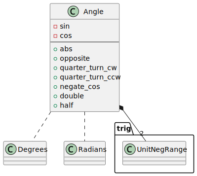

# angle-sc

[](https://crates.io/crates/angle-sc)
[](https://docs.rs/angle-sc/)
[](https://opensource.org/license/mit/)
[](https://github.com/kenba/angle-sc-rs/actions)
[](https://codecov.io/gh/kenba/angle-sc-rs)

A Rust library for performing accurate and efficient trigonometry calculations.  

## Description

The standard trigonometry functions: `sin`, `cos`, `tan`, etc. 
[give unexpected results for well-known angles](https://stackoverflow.com/questions/31502120/sin-and-cos-give-unexpected-results-for-well-known-angles#answer-31525208).  
This is because the functions use parameters with `radians` units instead of `degrees`.
The conversion from `degrees` to `radians` suffers from
[round-off error](https://en.wikipedia.org/wiki/Round-off_error) due to
`radians` being based on the irrational number π.

This library provides a [sincos](src/trig.rs#sincos) function to calculate more
accurate values than the standard `sin` and `cos` functions for angles in radians  
and a [sincosd](src/trig.rs#sincosd) function to calculate more accurate values
for angles in degrees.

The library also provides an [Angle](#angle) struct which represents an angle
by its sine and cosine as the coordinates of a
[unit circle](https://en.wikipedia.org/wiki/Unit_circle),  
see *Figure 1*.

  
*Figure 1 Unit circle formed by cos *θ* and sin *θ**

The `Angle` struct enables more accurate calculations of angle rotations and
conversions to and from `degrees` or `radians`.

## Features

* `Degrees`, `Radians` and `Angle` types;
* functions for accurately calculating sines and cosines of angles in `Degrees` or `Radians`
using [remquo](https://pubs.opengroup.org/onlinepubs/9699919799/functions/remquo.html);
* functions for accurately calculating sines and cosines of differences of angles in `Degrees` or `Radians`
using the [2Sum](https://en.wikipedia.org/wiki/2Sum) algorithm;
* functions for accurately calculating sums and differences of `Angles` using
[trigonometric identities](https://en.wikipedia.org/wiki/List_of_trigonometric_identities#Angle_sum_and_difference_identities);
* and some [spherical trigonometry](https://en.wikipedia.org/wiki/Spherical_trigonometry) functions.
* The library is declared [no_std](https://docs.rust-embedded.org/book/intro/no-std.html).

## Examples

The following example shows the `round-off error` inherent in calculating angles in `radians`.  
It calculates the correct sine and cosine for 60° and converts them back
precisely to 60°, but it fails to convert them to the precise angle in `radians`: π/3.
```rust
use angle_sc::{Angle, Degrees, Radians, is_within_tolerance, trig};

let angle_60 = Angle::from(Degrees(60.0));
assert_eq!(trig::COS_30_DEGREES, angle_60.sin().0);
assert_eq!(0.5, angle_60.cos().0);
assert_eq!(60.0, Degrees::from(angle_60).0);

// assert_eq!(core::f64::consts::FRAC_PI_3, Radians::from(angle_60).0); // Fails because PI is irrational
assert!(is_within_tolerance(
   core::f64::consts::FRAC_PI_3,
   Radians::from(angle_60).0,
   f64::EPSILON
));
```

The following example calculates the sine and cosine between the difference
of two angles in `degrees`: -155° - 175°.  
It is more accurate than calling the `Angle` `From` trait in the example above
with the difference in `degrees`.  
It is particularly useful for implementing the
[Haversine formula](https://en.wikipedia.org/wiki/Haversine_formula)
which requires sines and cosines of both longitude and latitude differences.  
Note: in this example sine and cosine of 30° are converted precisely to π/6.
```rust
use angle_sc::{Angle, Degrees, Radians, trig};

// Difference of Degrees(-155.0) - Degrees(175.0)
let angle_30 = Angle::from((Degrees(-155.0), Degrees(175.0)));
assert_eq!(0.5, angle_30.sin().0);
assert_eq!(trig::COS_30_DEGREES, angle_30.cos().0);
assert_eq!(30.0, Degrees::from(angle_30).0);
assert_eq!(core::f64::consts::FRAC_PI_6, Radians::from(angle_30).0);
```

## Design

### Trigonometry Functions

The [trig](src/trig.rs) module contains accurate and efficient trigonometry functions.

### Angle

The `Angle` struct represents an angle by its sine and cosine instead of in
`degrees` or `radians`, see *Figure 2*.  

  
*Figure 2 Angle Class Diagram*

This representation an angle makes functions such as
rotating an angle +/-90° around the unit circle or calculating the opposite angle;
simple, accurate and efficient since they just involve changing the signs
and/or positions of the `sin` and `cos` values.

`Angle` `Add` and `Sub` traits are implemented using
[angle sum and difference](https://en.wikipedia.org/wiki/List_of_trigonometric_identities#Angle_sum_and_difference_identities)
trigonometric identities, 
while `Angle` [double](https://en.wikipedia.org/wiki/List_of_trigonometric_identities#Double-angle_formulae)
and [half](https://en.wikipedia.org/wiki/List_of_trigonometric_identities#Half-angle_formulae) methods use other
trigonometric identities.

The `sin` and `cos` fields of `Angle` are `UnitNegRange`s:,
a [newtype](https://rust-unofficial.github.io/patterns/patterns/behavioural/newtype.html)
with values in the range -1.0 to +1.0 inclusive.  

## Contribution

If you want to contribute through code or documentation, the [Contributing](CONTRIBUTING.md) guide is the best place to start. If you have any questions, please feel free to ask.
Just please abide by our [Code of Conduct](CODE_OF_CONDUCT.md).

## License

`angle-rs` is provided under a MIT license, see [LICENSE](LICENSE).
